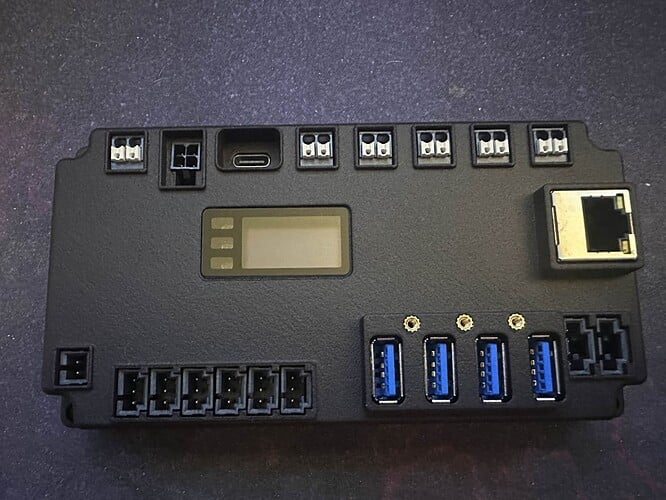

---
date:
  created: 2025-07-08
authors:
  - carvalho
---

# Semana 1 — Chegada do SystemCore

A espera finalmente terminou, o novo **SystemCore** chegou para as equipes de FRC que estão participando do processos de testes Alfa (Vocês podem ler mais sobre [neste blog](https://community.firstinspires.org/systemcore-alpha-testing-first-wave)), e já estamos explorando todos os detalhes técnicos. Está claro que o SystemCore da Limelight não é apenas uma evolução pequena, a gente vai ter grandes mudanças em software e hardware daqui pra frente.
<!-- more -->

  

## Para quem não conhece: o que é o SystemCore?

O **SystemCore** é o novo módulo computacional desenvolvido pela Limelight, projetado para ser o “cérebro central” dos robôs da _FIRST Tech Challenge_ e _FIRST Robotics Competition_. Substituindo os amados roboRIO e Control Hub.

Na prática, ele funciona como uma central unificada que combina:

- **Processamento de alto desempenho**: baseado em arquitetura ARM moderna, capaz de rodar algoritmos de visão e controle em tempo real no próprio módulo, sem depender de co-processadores externos. Em comparação, o **roboRIO**, é muito mais limitado em capacidade de processamento geral e praticamente inviável para tarefas pesadas de visão computacional por exemplo.
- **Gerenciamento de entradas e saídas (I/O)**: possibilita controlar sensores, atuadores, LEDs e outros dispositivos diretamente, com latência mínima.
- **Conectividade ampla**: inclui 5 interfaces CAN FD, Ethernet, Wi-Fi, Bluetooth, USB e PCIe, permitindo integração com praticamente qualquer subsistema do robô.
- **Sensores embarcados**: como a IMU (unidade de medição inercial), essencial para navegação autônoma e estabilização.

O grande diferencial do SystemCore é a melhora de desempenho e novas tecnologias comparado com o roboRIO e o Control Hub

## Arquitetura e processamento

No centro do SystemCore está o **Raspberry Pi CM5**, equipado com um processador quad-core ARM Cortex-A76 a 2.4 GHz. Acompanha 4 GB de RAM LPDDR4X de alta velocidade e 16 GB de armazenamento interno eMMC. O processamento gráfico fica por conta do VideoCore VII, com suporte a OpenGL ES e Vulkan, permitindo interfaces gráficas ricas e atualizações em tempo real.

Complementando a arquitetura principal, existe um subsistema em tempo real baseado no **RP2350** (dual-core Cortex-M33 a 150 MHz). Este microcontrolador gerencia as entradas e saídas críticas, leitura de sensores e monitoramento de falhas, garantindo baixa latência e maior confiabilidade.

## Conectividade

O SystemCore foi projetado como um verdadeiro hub para sistemas robóticos avançados:

- **5 interfaces CAN FD**, suportando até 8 Mbps, com terminação integrada de 120 Ω. (SIM, 5 BARRAMENTOS DE REDE CAN PARALELOS!!!!!!!!!!!)
- **4 portas USB 3.0**, para conexão de câmeras, módulos de expansão ou armazenamento.
- **Ethernet Gigabit**, Wi-Fi dual-band (2.4 e 5 GHz) e Bluetooth 5.0. Principalmente para ser utilizada pela FTC e para debug da FRC, ela não vai subsitituir o rádio VH-109 da FRC em quadra.
- **Porta PCIe M.2**, permitindo futuras expansões. Como o já utilizado por equipes de FRC, [Halio - 8](https://stemos.com.br/produto/11010293/), que permite o processamento de imagem utilizando IA.
- **Porta BRIDGE**, que integra alimentação e CAN em um único cabo, pensada para integração com o MotionCore (Exclusivo para uso das equipes de FTC).

## Entradas e saídas flexíveis

O módulo possui **6 portas I/O** configuráveis em tempo real, suportando:

- Entradas e saídas digitais
- PWM
- Entradas analógicas (12-bit ADC, 0 a 3.3 V)
- LEDs endereçáveis* 
- Decodificação de quadratura*
- **Aqui temos uma mudança importante para as equipes de FRC, as portas I/O do SystemCore trabalham em 3.3V, não em 5V como no roboRIO**

\* Algumas funções estão em fase final de validação.

O ADC atinge taxas de amostragem de até 500 kS/s, com alta precisão e linearidade. Todo o sistema de I/O conta com proteção contra sobrecorrente, sobretensão e ESD de até ±30 kV.

## IMU integrada

A unidade de medição inercial (IMU) fornece dados a 400 Hz, incluindo quaternions, aceleração (±4 G a ±32 G) e giroscópio (±125°/s a ±4000°/s). Esses recursos oferecem novas possibilidades para estratégias de navegação e estabilização avançada. Eliminando a necessidade de sensores externos como o NavX e Pidgeon 2.0, enquanto diminui o tempo de resposta do sensor.

## Gerenciamento de energia e robustez

O SystemCore opera em uma faixa ampla de tensão (5 V a 26 V), com arquitetura buck-boost e consumo máximo de 40 W. Conta com proteção contra polaridade reversa, brownout configurável e relatórios de falhas em display OLED, LEDs de status e via telemetria do robô.

O design físico reforça a durabilidade: base em alumínio, topo em ABS/PC, revestimento conformal na placa principal e conectores projetados para reduzir a entrada de poeira e detritos, atendendo às condições mais exigentes em campo.

- Mais informações técnicas preliminares sobre o systemcore, podem ser encontradas [aqui.](https://downloads.limelightvision.io/documents/systemcore_specifications_june15_2025_alpha.pdf)
- Todas as atualizações sobre o progresso da fase de testes Alfa, assim como mais informações sobre o systemcore, estão no [Github do Systemcore.](https://github.com/wpilibsuite/SystemCoreTesting)

## Recebimento e primeiros passos na 1156

A gente já recebeu o nosso SystemCore e iniciou os testes preliminares. Preparamos uma lista detalhada de verificações para avaliar desempenho térmico, estabilidade do CAN, resposta das I/Os em condições reais e integração com nossos subsistemas de movimento. Nas próximas semanas, publicaremos os primeiros resultados e análises práticas.

## Conclusão

O SystemCore marca uma nova fase no controle embarcado para robôs da _FIRST_. Combinando processamento potente, conectividade abrangente e foco em confiabilidade, abre espaço para soluções mais ambiciosas e maior visibilidade sobre a performance do robô em tempo real.

Seguiremos compartilhando atualizações detalhadas sobre cada etapa dos nossos testes. Acompanhe o blog para acompanhar as descobertas e os avanços no uso deste novo sistema.

Tem algo específico que sua equipe quer saber? Nos chamem no insta, ou comentem aqui!

